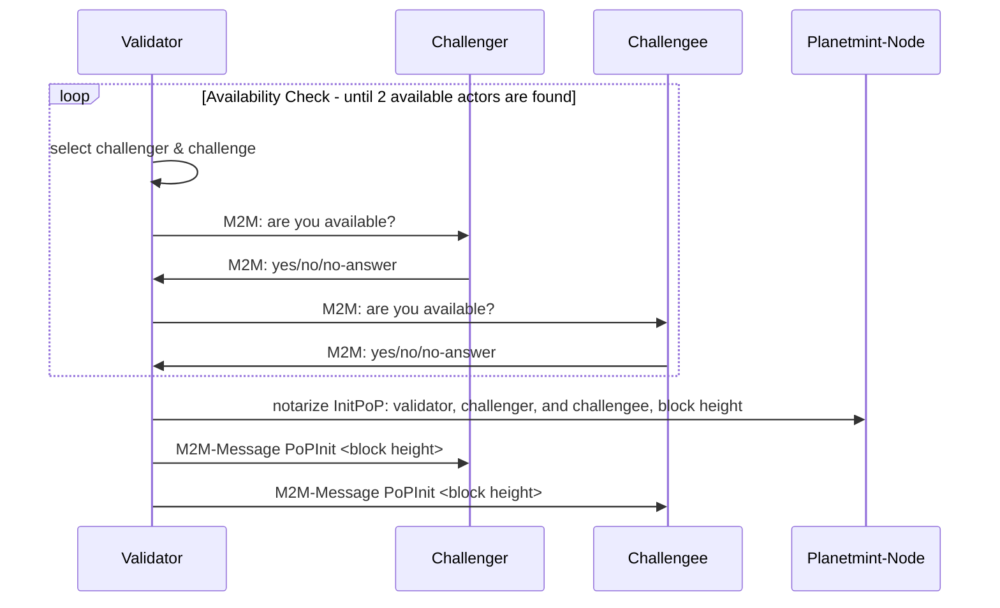

# 👩🎤 Actor Selection

The CometBFT consensus algorithm selects the acting validator. The algorithm selects Block creators for each epoch/block.

The thereby elected validator is the master of ceremony for this very execution of the PoP and performs the following actions

1. selects a challenger and a challengee
2. verifies their availability via m2m (mqtt)
3. notarizes the selection via an InitPoP message containing
   * the validator-address,
   * challenger address
   * challengee address
   * block height
4. sends a PopInit command containing the block height of the PoP to the challenger and the challengee with the expectation that both will perform the PoP.

