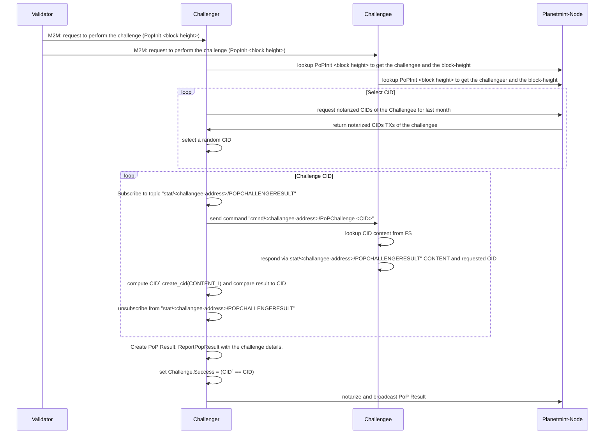

# ⁉ Challenge-Response

At the end of an epoch (2 min), the proposing Validator initiates the PoP-related challenge response by sending MQTT messages to the challenger and the challengee (see [Actor Selection ](actor-selection.md)paragraph).

The initialized challenge-response process is described below:

1. Challenger and challengee request the details of the PoP by calling [/planetmint/dao/challenge/{height}](https://testnet-api.rddl.io/#/Query/PlanetmintgoDaoGetChallenge).
2. The challenger selects a random `CID` from a list of CIDs for a certain period of time provided by calling [/planetmint/asset/address/{address}/{lookupPeriodInMin}](https://testnet-api.rddl.io/#/Query/PlanetmintgoAssetGetCIDsByAddress).
3. The challenger subscribes to the `PoPChallengeResult-`topic of the challangee (`stat/<challangee-address>/POPCHALLENGERESULT`).
4. The challenger sends the `cmnd/<challangee-address>/PoPChallenge <CID>` command to the challengee.
5. The challengee looks up the corresponding CID data and transfers it to the challenger via the `POPCHALLENGERESULT`command.
6. The challenger receives the data via the subscribed topic and computes the `CID'` of the provided content.&#x20;
7. The challenger notarizes a ReportPopResult message with `Success = true` if the computed `CID'` equals the requested `CID` and `Success = false`, otherwise.
8. The challenger unsubscribes from `stat/<challangee-address>/POPCHALLENGERESULT`.

