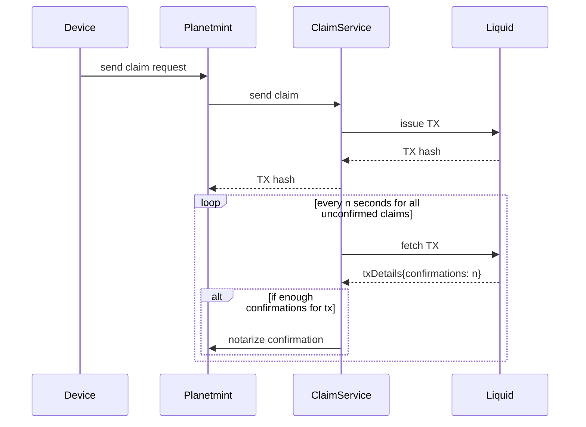

# 🪙 Claiming Rewards

## Pre-requirements

* A device that has participated in Proof of Productivity challenges (i.e. that has received claims in the form of \`crddl\`)
* A beneficiary address for a liquid wallet

## Step-by-step guide

1. Connect to your Energy Agent
2. Go to **RDDL Network->Claim Rewards**
3. Enter `<beneficiaryLiquidAddress>` containing (e.g.: `tlq1qq2e96fx7t0gvtq9lhk3vg7qwf7s08479ap3wqyelp2c4ds9y7wesk97fd0sla2s7qck4ezns3gy6s8h4qw3e2tqkyfnkvxs4u`)

## How it works

1. Your device sends a transaction containing the beneficiary of the RDDL token claim to Planetmint
2. Planetmint sends a claim request with your total amount of \`crddl\` to the ClaimService
3. The ClaimService issues a transaction on liquid to send the according amount of RDDL tokens to the supplied liquid address and updates your claim on Planetmint with the corresponding liquid transaction ID
4. &#x20;Following the issuing of the liquid transaction, the ClaimService will continuously poll for confirmations on the liquid network
5. Once enough confirmations are reached the ClaimService sends a confirmation to Planetmint finishing the process

## Sequence diagram

