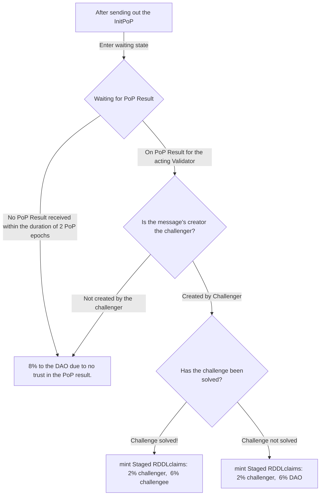

# 🔢 Reward Calculation

The network waits for the challenger to respond with the ReportPopResult for two PoP epochs (2 times 2 minutes). The rewards for the PoP are then calculated depending on the outcome of the PoP.

