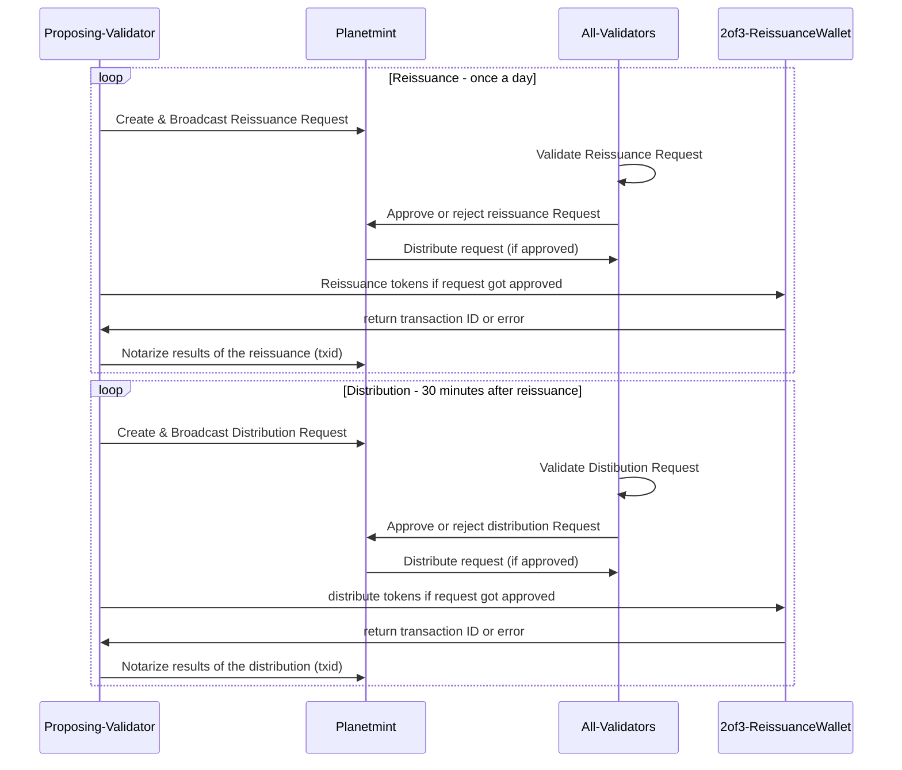

# 🤝 Reissuance & Distribution

RDDL Network initially anticipated notarizing all important aspects of two chains: Liquid and Planetmint.  It, of course, turned out not to be economically sustainable. Therefore, all PoP rewards and distribution activities are notarized on Liquid once a day. This process contains two steps: the reissuance of the RDDL tokens and their distribution.

The tokens are distributed to the following wallets: DAO, PoP, early investor, investor and strategic investment.&#x20;

### Reissuance

Reissuance is triggered periodically (once daily, configurable by the network) by the network. The block proposing validator iterates over all challenges since the last reissuance and computes the number of tokens to be reissued.&#x20;

The block proposer creates and broadcasts a `ReissueRDDLProposal` message. The network validates the message. The block proposer reissues the calculated tokens once the network confirms the message. After that, the proposer also creates a `ReissueRDDLResult` message with the details about the reissuance. &#x20;

### Distribution

The distribution of the reissued tokens is set to 30 minutes (15 epochs) after the reissuance. The block proposer initializes the distribution by issuing the `DistributionRequest` message. The network validates the message. The block proposer distributes the tokens following the proposal after the network confirms the message. After that, the proposer creates a DistributionResult message with the corresponding transaction IDs and broadcasts the message to the network.

