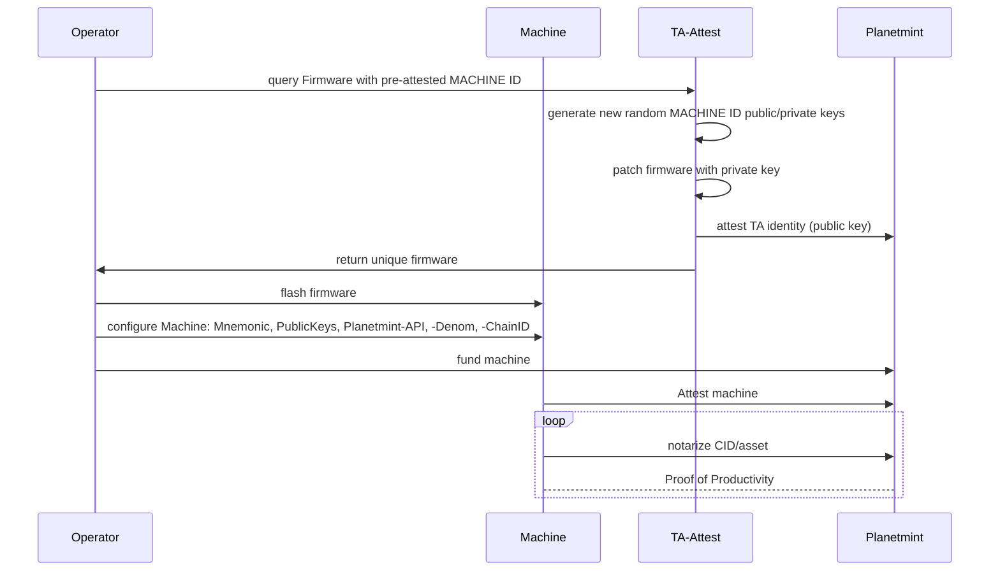
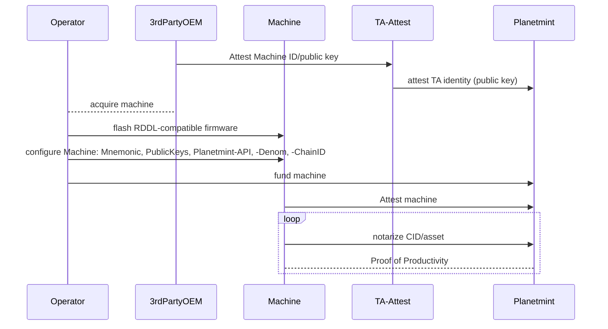
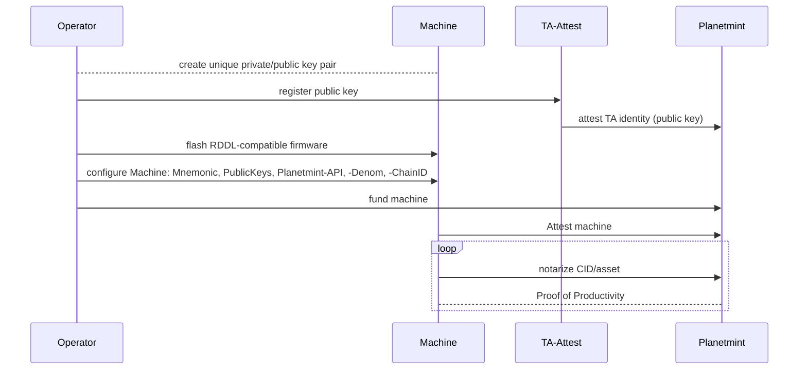

# Registration of Machine ID and Attesting to the Network

Every hardware interacting with RDDL Network needs to be attested before being able to start interacting. RDDL Networks assumes that hardware comes with a hardware secure element such as integrate in the [Trust Anchor](../rddl-compatible-devices/trust-anchor.md) and expects that Trust Anchors are registered to the network before interaction starts.&#x20;

Trust Anchors are identified via their a public/private keypair that is provisioned to them and might never change. The public key is registered to the chain via the TrustAnchor Attestation serivce [https://testnet-ta.rddl.io](https://testnet-ta.rddl.io).

The service deploys new random identites to downloaded firmwares and in the case of the testnet, enalbe the registration of public keys in the format of string of characters representing a the [bytes of the public secp256k1 public key](https://github.com/rddl-network/ta\_attest/blob/main/cmd/ta/main.go#L203).


The machineID and the corresponding public private key pair are used for the machine on-boarding onto the network. This key pair is unrelated to the key material used to interact with the chain directly (e.g. to sign transactions, hold funds, ...).


RDDL Network expects HW OEM vendors to register their devices on chain so that they are able to start interacting after attesting their machines.&#x20;

The RDDL testnet allows a more flexible handling of the machineID in order to ease the on-boarding of new hardware and machines. Details about the workflows can be found at [connecting your Machine to the Network](./)[.](./)

***

If you want to work with the Test net **AND** The Main net you can do so either by using Machines with unique Firmware or Machines with a Secure Element. If you are just interested in learning with the Test net, you can simply use Machines with self-registered Public Key. Be aware that these Machines are not supported on the Main net.\

## Testnet + Mainnet:

### 1. Machines with unique Firmware

The sequence diagram below shows how a unique firmware is created. The randomly inserted private injected key makes the firmware unique. The corresponding public key is notarized on Planetmint after that.

The Tasmota reference implementation can be downloaded from

* [https://testnet-ta.rddl.io/firmware/esp32](https://testnet-ta.rddl.io/firmware/esp32) for ESP32 devices
* [https://testnet-ta.rddl.io/firmware/esp32c3](https://testnet-ta.rddl.io/firmware/esp32c3) for ESP32C3 devices.

The download will include the previously mentioned steps.&#x20;

A call to [https://testnet-api.rddl.io/#/Query/PlanetmintgoMachineGetTrustAnchorStatus](https://testnet-api.rddl.io/#/Query/PlanetmintgoMachineGetTrustAnchorStatus) with your machine ID, the public key of the TA, shows if your public key got properly attested and if the corresponding machine has already attested.


The machine ID of the RDDL-Tasmota devices is shown by calling _**PublicKeys.**_


### 2. Machines with Secure Element

## Testnet Only

3. Machines with self-registered Private Key

The sequence diagram below shows how the public key of the corresponding private key is registered on the testnet. The registration will enable individuals to onboard their machines easily without having a final RDDL-compatible firmware or hardware.


This process is suggested to be used during the development and evaluation phase.


An HTTP POST request to  https://testnet-ta.rddl.io/register/\<pub key as hex string> will let you register your public key. Here is a sample call\
`curl -X POST https://testnet-ta.rddl.io/register/02d52a0163ae5f0b22cf46e9c415a12024bc1e9e6833e2fe78b4f0754f3d52404a`\
with `02d52a0163ae5f0b22cf46e9c415a12024bc1e9e6833e2fe78b4f0754f3d52404a` being the representation of the public key.

A call to [https://testnet-api.rddl.io/#/Query/PlanetmintgoMachineGetTrustAnchorStatus](https://testnet-api.rddl.io/#/Query/PlanetmintgoMachineGetTrustAnchorStatus) with your machine ID, the public key of the TA, shows if your public key got properly attested and if the corresponding machine has already attested.
