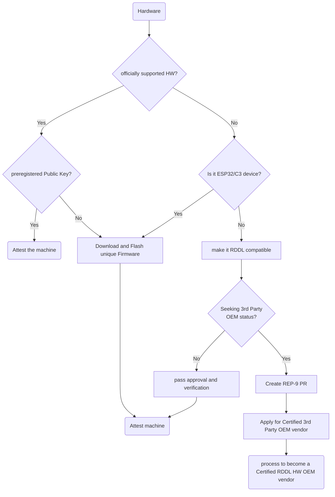

# Is my Hardware Supported?

Registering your Machine ID is a crucial step in onboarding your machine to the RDDL Network. The process varies depending on your machine type. Below, you'll find a flowchart that outlines the steps based on whether your hardware is RDDL certified, officially supported, or currently unsupported.

**Flowchart Explanation:**

1. **RDDL Certified Hardware:**
   * As soon as your hardware is RDDL certified, it is officially supported.
   * Check if it comes with a unique preregistered Public Key.
   * If yes, you can directly use your hardware and proceed to attest the machine.
2. **Supported Hardware:**
   * If your hardware is officially supported but **DOES NOT** come with a unique preregistered Public Key:
     * Download the unique firmware provided.
     * Flash the firmware onto your [supported hardware](getting-connected/rddl-compatible-devices/).
     * Proceed to attest your machine.
   * If your hardware is officially supported and **DOES** come with a unique preregistered Public Key:
     * &#x20;you can Proceed to attest your machine.
3. **Unsupported Hardware:**
   * If your hardware is ESP32/C3, follow the flow to download unique firmware and attest.
   * If your hardware is **NOT** a ESP32/C3 device:
     * Integrate libRDDL and implement Testnet compatibility.
     * Pass the [hardware approval and verification process](rddl-network-hw-approval-process.md).
     * Create [REP-9](https://github.com/rddl-network/REPs) Pull Request.
     * Apply to become a Certified 3rd Party OEM vendor for RDDL.

By following the steps in this flowchart, you can successfully register your Machine ID based on your hardware type. If you encounter any challenges or have questions, feel free to refer to additional resources or contact our support team for assistance. Happy onboarding!
