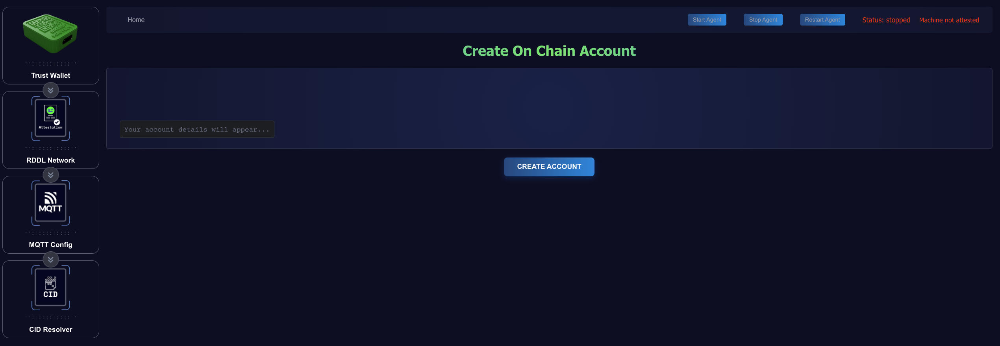
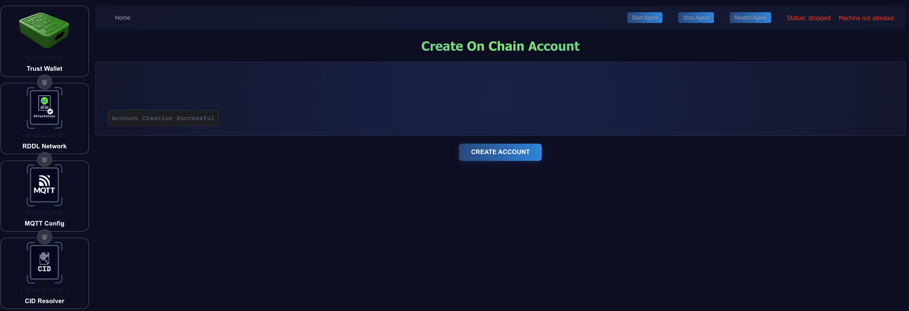
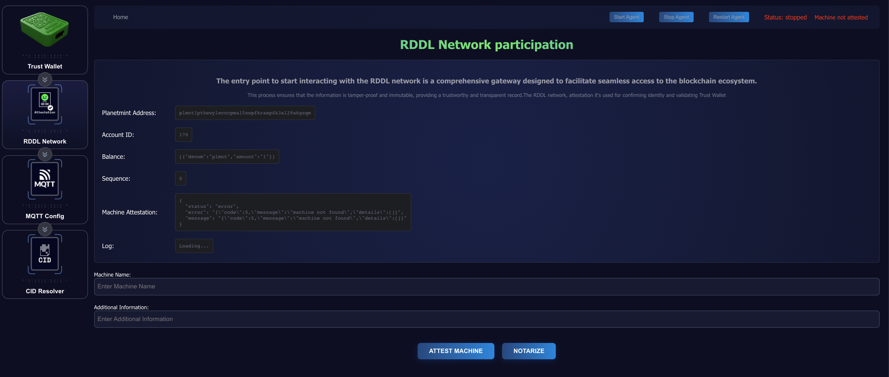
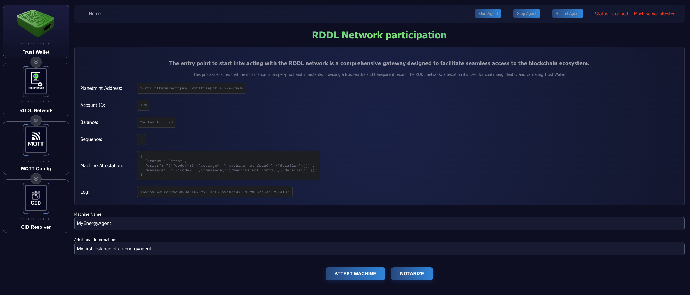

# ▶️ Installation


For any additional questions or needed support please access our Discord\
[https://discord.com/invite/ACqqn8d5](https://discord.com/invite/ACqqn8d5)


## Prerequisites

### Hardware Requirements

* [RDDL Energy Agent](./)
* [Trust Wallet](../trust-anchor.md)
* Network connection (Ethernet or WiFi)
* Power supply for Energy Agent
* [Smart Metering Device (SMD)](../smd-smart-metering-device.md)

### Initial Setup

#### **Finding Your Device on the Network**

You first need to identify the IP Address for your Energy Agent via you local network.&#x20;

Using your router's admin interface:

* Look for connected devices
* Find the device named "recomputer", "r1000" or similar

#### **Connecting to Your Device**

Once identified you need to ssh to the Energy Agent:

* open up a terminal
* Enter the SSH command: \
  `ssh recomputer@<YOUR_DEVICE_IP>`\
  and hit Enter
* On first connection, you'll see a security prompt about the host's authenticity:\
  `The authenticity of host '<IP>' can't be established... Are you sure you want to continue connecting (yes/no/[fingerprint])?`\
  Type "yes" and press Enter
* When prompted for password, enter:\
  `12345678`
* For security purposes, it's strongly recommended to change the default password immediately after first login.\
  Run the password change command:\
  `sudo passwd`

## Energy Agent Installation

Once connected via ssh maneuver to a desired directory to run the following 3 commands:




```bash
wget https://raw.githubusercontent.com/rddl-network/EnergyAgent/main/prepare_energy_agent.sh
```




Confirm with Enter



```bash
chmod 755 prepare_energy_agent.sh
```



Confirm with Enter



```bash
./prepare_energy_agent.sh
```



Confirm with Enter


The above commands will download an installation script that executes the following tasks:

a) Updates your system

b) Installs docker

c) Downloads the latest docker-compose file

d) Loads the docker-compose file and starts the Energy Agent and its dependencies

## Configuration

The client's default configuration should be sufficient to start working on this set-up guide. The [EnergyAgents Readme on Git Hub](https://github.com/rddl-network/EnergyAgent) gives an overview of the environment variables that can be adjusted.

The EnergyAgent appears on the device's IP at port 2138 per default. \
In a browser, open up \<YOUR\_DEVICE\_IP>:2138 \
example: 192.168.1.100:2138

### Initialize the TrustWallet

The TrustWallet comes pre-provisioned and attested to be used on the mainnet. However, the EnergyAgnt needs a set of unique keys before connecting to the mainnet, so the TrustWallet needs to be configured. Within the TrustWallet menu (select Trust Wallet Icon on the left), then click **Create Mnemonic**.&#x20;


<figure><figcaption></figcaption></figure>

Click **Create Mnemonic** a second time to generate your Mnemonic Phrase.


Please write down and store the resulting mnemonic phrase in a safe and private place. It's the only way to recover your funds if necessary.


<figure><figcaption></figcaption></figure>


### On-chain account creation

The machine attestation process to register EnergyAgent on the chain is free. However, the chain must know about your account in advance to accept signed transactions.  That's why the account needs to be created after the TrustWallet is initialized.\
\
Select Trust Wallet Icon on the left. Then select **Create Account**. And then hit **Create Account** a second time.

<figure><figcaption></figcaption></figure>

Please wait for a successful response. Retry if the requests aren't successful.

<figure><figcaption></figcaption></figure>

### RDDL-Network interaction

The initial RDDL Network interaction can be broken down into the following aspects.

Both can be accessed via the RDDL Network Icon on the left side of the screen.

Before attesting your Machine please change the **Machine Name** and **Additional Information** (must be data filled) to something private.\
\


<figure><figcaption></figcaption></figure>

The page will initially show:&#x20;

* The address on planetmint
* an initial balance of 1 plmnt
* a sequence number of 0
* a non-existing attestation

Then click **Attest Machine** which will create and broadcast a machine attestation transaction on Planetmint. Then Select **NOTARIZE.**


<figure><figcaption></figcaption></figure>

The Logline will contain an error message or the transaction ID of the transaction being created and broadcasted. The transaction ID can be inspected on the [explorer](https://explorer.rddl.io/planetmint) after the next block consensus which happens every 24 seconds.

Notarization requests can be issued by clicking the Notarize button on the RDDL Network page.

### Connecting to SMDs (MQTT configuration)

The MQTT Config page enables connecting to SMDs.

&#x20;Enter the local IP, the default port 1883, or any other MQTT service used with the SMD's

* Select Energy Agent MQTT

The local MQTT service comes without a user/password per default. This can of course be changed.

<figure><figcaption></figcaption></figure>

### Starting the EnergyAgent

Select **Start Agent** button on the upper right side.\
The Energy Agent will start notarizing periodically after clicking the **Start Agent.**

<figure><figcaption></figcaption></figure>

