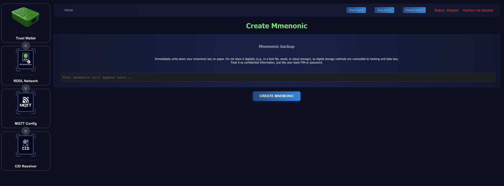
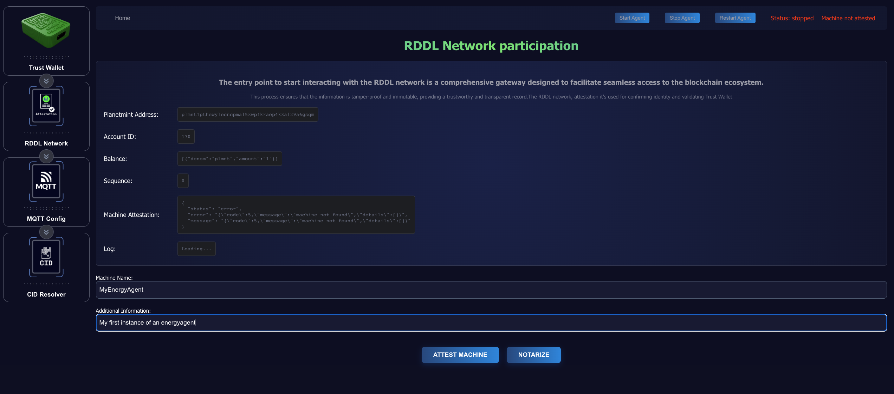

# ▶️ Installation

The installation of the essential components can be quickly done by running the following command after plugging the TrustWallet into the Energy Agent:

`wget https://raw.githubusercontent.com/rddl-network/EnergyAgent/main/prepare_energy_agent.sh | sudo chmod 755 prepare_energy_agent.sh | sudo ./prepare_energy_agent.sh`\
\
The above command will download an installation script that executes the following tasks:

1. Updates your system
2. Installs docker
3. Downloads the latest docker-compose file
4. Loads the docker-compose file and starts the Energy Agent and its dependencies

## Configuration

The client's default configuration should be sufficient to start working on this set-up guide. The [EnergyAgents Readme on Git Hub](https://github.com/rddl-network/EnergyAgent) gives an overview of the environment variables that can be adjusted.

The EnergyAgent appears on the device's IP at port 2138 per default.


The EnergyAgent is set up to connect you to the testnet.


### Initialize the TrustWallet

The TrustWallet comes pre-provisioned and attested to be used on the mainnet. However, the EnergyAgnt needs a set of unique keys before connecting to the mainnet, so the TrustWallet needs to be configured. Within the TrustWallet menu, click **Create Mnemonic**.

<figure><figcaption></figcaption></figure>


Please write down and store the resulting mnemonic phrase in a safe and secret place. It's the only way to recover your funds in a disaster.


<figure><figcaption></figcaption></figure>

### On-chain account creation

The machine attestation process to register EnergyAgent on the chain is free. However, the chain must know about your account in advance to accept signed transactions.  That's why the account needs to be created after the TrustWallet is initialized.

This task can also be initiated within the TrustWallet menu.

<figure><figcaption></figcaption></figure>

Please wait for a successful response. Retry if the requests aren't successful.

<figure><figcaption></figcaption></figure>

### RDDL-Network interaction

The initial RDDL Network interaction can be broken down into the following aspects.

1. machine attestation
2. notarization of data

Both can be accessed via the RDDL Network pane on the left side of the screen.

<figure><figcaption></figcaption></figure>

The page will initially show:&#x20;

* The address on planetmint,&#x20;
* an initial balance of 1 plmnt,
* a sequence number of 0,
* a non-existing attestation.

<figure><figcaption></figcaption></figure>

Filling out the **Machine Name** and **Additional Information** and clicking **Attest Machine** will create and broadcast a machine attestation transaction on Planetmint.

<figure><figcaption></figcaption></figure>

The Logline will contain an error message or the transaction ID of the transaction being created and broadcasted. The transaction ID can be inspected on the [explorer](https://explorer.rddl.io/planetmint) after the next block consensus which happens every 24 seconds.

Now, Notarization requests can be issued by clicking the Notarize button on the RDDL Network page.

### Connecting to SMDs (MQTT configuration)

The MQTT Config page enables connecting to SMDs.

&#x20;Enter the local IP, the default port 1883, or any other MQTT service used with the SMDs.

The local MQTT service comes without a user/password per default. This can, of course, be changed.

<figure><figcaption></figcaption></figure>

### Starting the EnergyAgent

The Energy Agent will start notarizing periodically after clicking the **Start Agent** button on the upper right side.

