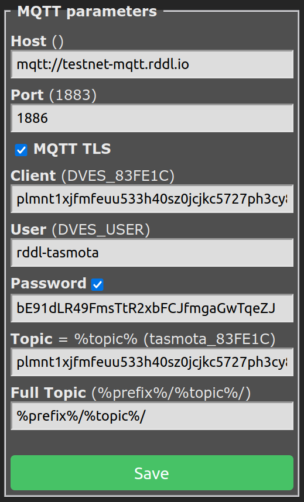

# ✅ Understanding RDDL

## How RDDL works

Please read the [Whitepaper](https://www.rddl.io/s/The-RDDL-Network-Vision-for-a-Physical-Trust-Layer-v13.pdf) of the RDDL network to get introduced to all the details and concepts.

RDDL Network is the implementation of a protocol that achieves the following pillars:

1. Connects and notarizes **Layer 0** (industrial and consumer machines) machines and their actions
2. Tokenizes **Layer 0** entities (optional) on Liquid - the Bitcoin sidechain - (**Layer 2**)
3. Rewards productivity (if proven) - **Proof of Productivity** (**PoP**) - Liquid - the Bitcoin sidechain - (**Layer 2**)
4. Notarizes data and productivity on Planetmint, a **Layer 1** solution

<figure><figcaption>
Layer Overview
</figcaption></figure>

### Prerequisites

An RDDL-compatible device must be attached and connected to the machine to connect the machine to the RDDL network. The RDDL-compatible device expects internet access to connect to the RDDL network.&#x20;

The RDDl device has to run the [0x21e8 RDDL Interaction Service](https://github.com/rddl-network/0x21e8). The rddl-client usually initiates interaction with the service and RDDL network.

#### Key Ceremony

The machine needs to be provisioned with a secret that will be used to derive public and private keys and identities for Planetmint and Liquid - just before the first network interactions can take place.

### The Basics

Machines must be attested to the network before they can notarize data and productivity and participate in the PoP.

### Machine Attestation

The attestation process is executed on the RDDL community device. Detailed information can be found at[machine-attestation.md](../use-cases/machine-attestation.md "mention"). During the initial attestation process of a machine, the specifics of its investment capabilities can be defined. These definitions implicitly represent the token issuance process of the device.&#x20;

### Token Issuance

Amongst others, the following parameters must be defined for the issuance process

1. **amount** of tokens issued, e.g. something between 0 and 21 million. 0 is a corner case that indicates that no permit will be issued for the given machine.
2. A **ticker**, 3 to 5 ASCII characters in length (e.g. “IPA”), used to denominate the amounts in a recognizable unit,
3. an extended **name**, 5 to 255 ASCII characters in length (e.g. “The RDDL network token”), to give a human-readable title to the Issued Assets
4. a **domain** that the issuer must control (e.g. “rddl.com”) is used to tie together all of the above information to the entity containing the domain submitted to the registry.
5. Decimal **precision** is mainly helpful for issuers. For instance, two places of decimal precision would mean that 199 satoshis of the Issued Asset should be interpreted as 1.99 units of the Asset.

The official documentation about how to [issue tokens on Liquid](https://docs.blockstream.com/liquid/technical\_overview.html#issued-assets) defines what needs to be defined for the machine token in more detail.&#x20;
