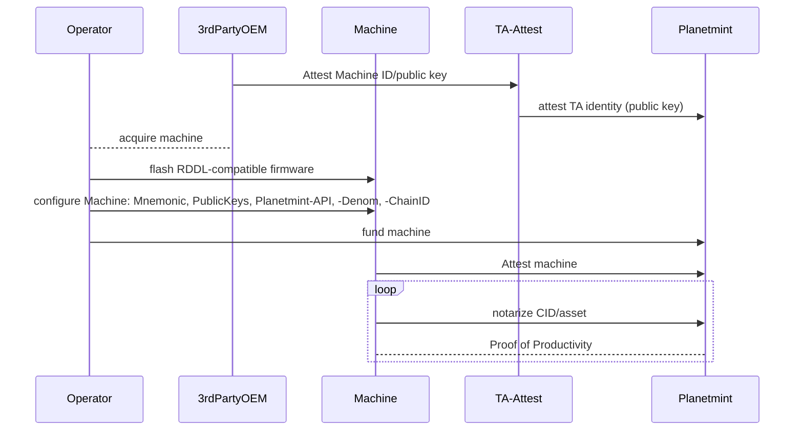

# Machines with Secure Element (Testnet\&Mainnet)

```mermaid
sequenceDiagram
    participant Operator
    participant 3rdPartyOEM
    participant Machine
    participant TA-Attest
    participant Planetmint
    3rdPartyOEM->>TA-Attest: Attest Machine ID/public key
	  TA-Attest->>Planetmint: attest TA identity (public key)
    Operator-->3rdPartyOEM: acquire machine
    Operator->>Machine: flash RDDL-compatible firmware
    Operator->>Machine: configure Machine: Mnemonic, PublicKeys, Planetmint-API, -Denom, -ChainID
    Operator->>Planetmint: fund machine
    Machine->>Planetmint: Attest machine
    loop 
    Machine->>Planetmint: notarize CID/asset
    Machine-->Planetmint: Proof of Productivity
    end
```
