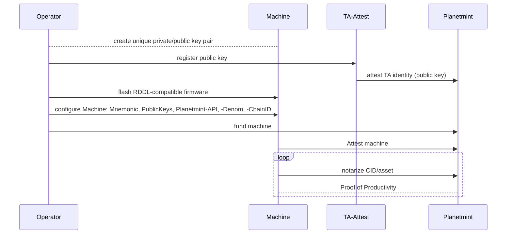

# Machines with self-registered Private Key (Testnet)

The sequence diagram below shows how the public key of the corresponding private key is registered on the testnet. The registration will enable individuals to onboard their machines easily without having a final RDDL-compatible firmware or hardware.


This process is suggested to be used during the development and evaluation phase.


An HTTP POST request to  https://testnet-ta.rddl.io/register/\<pub key as hex string> will let you register your public key. Here is a sample call\
`curl -X POST https://testnet-ta.rddl.io/register/02d52a0163ae5f0b22cf46e9c415a12024bc1e9e6833e2fe78b4f0754f3d52404a`\
with `02d52a0163ae5f0b22cf46e9c415a12024bc1e9e6833e2fe78b4f0754f3d52404a` being the representation of the public key.

A call to [https://testnet-api.rddl.io/#/Query/PlanetmintgoMachineGetTrustAnchorStatus](https://testnet-api.rddl.io/#/Query/PlanetmintgoMachineGetTrustAnchorStatus) with your machine ID, the public key of the TA, shows if your public key got properly attested and if the corresponding machine has already attested.
