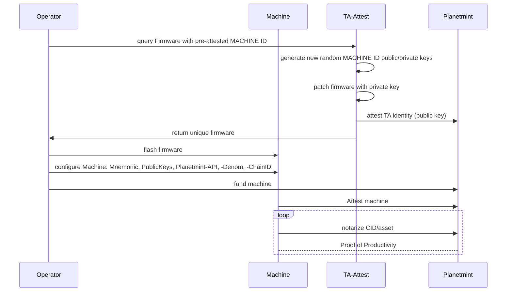

# Machines with unique Firmware (Testnet\&Mainnet)

The sequence diagram below shows how a unique firmware is created. The randomly inserted private injected key makes the firmware unique. The corresponding public key is notarized on Planetmint after that.

The Tasmota reference implementation can be downloaded from

* [https://testnet-ta.rddl.io/firmware/esp32](https://testnet-ta.rddl.io/firmware/esp32) for ESP32 devices
* [https://testnet-ta.rddl.io/firmware/esp32c3](https://testnet-ta.rddl.io/firmware/esp32c3) for ESP32C3 devices.

The download will include the previously mentioned steps.&#x20;

A call to [https://testnet-api.rddl.io/#/Query/PlanetmintgoMachineGetTrustAnchorStatus](https://testnet-api.rddl.io/#/Query/PlanetmintgoMachineGetTrustAnchorStatus) with your machine ID, the public key of the TA, shows if your public key got properly attested and if the corresponding machine has already attested.


The machine ID of the RDDL-Tasmota devices is shown by calling _**PublicKeys.**_

