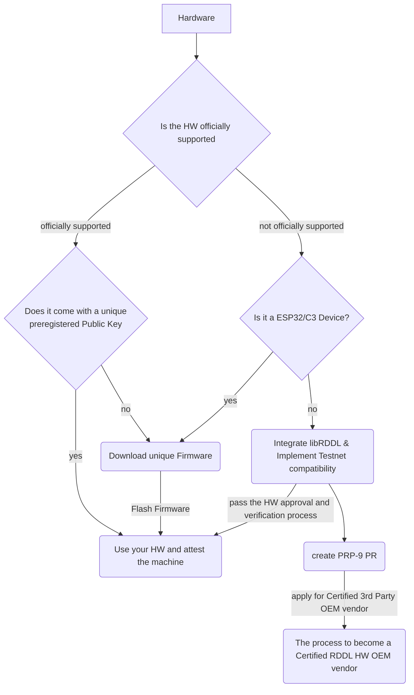

# How to register your Machine ID

The way the machine ID is registered depends on the machine type

1. RDDL certified hardware
2. RDDL-compatible hardware
3. unsupported hardware

The below-mentioned flow chart highlights what needs to be done in each case. Unsupported hardware can be used but needs to become compatible. Interested entities can become a 3rd party certified OEM partner and apply for a process to register machine IDs for the mainnet on their own.&#x20;

