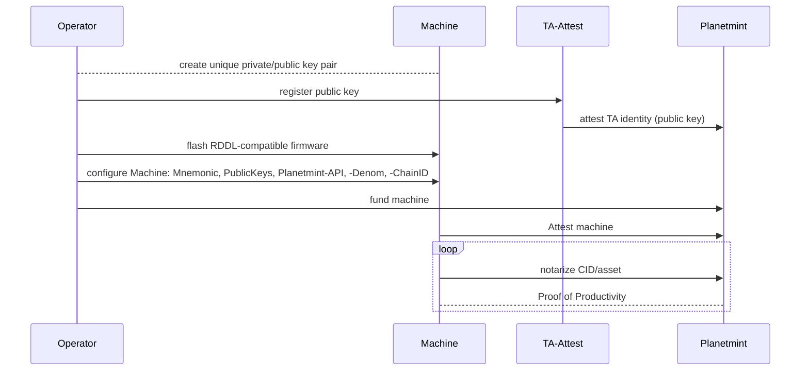

# Machines with self-registered Private Key (Testnet)

```mermaid
sequenceDiagram
    participant Operator
    participant Machine
    participant TA-Attest
    participant Planetmint
    Operator-->Machine: create unique private/public key pair
    Operator->>TA-Attest: register public key
	  TA-Attest->>Planetmint: attest TA identity (public key)
    Operator->>Machine: flash RDDL-compatible firmware
    Operator->>Machine: configure Machine: Mnemonic, PublicKeys, Planetmint-API, -Denom, -ChainID
    Operator->>Planetmint: fund machine
    Machine->>Planetmint: Attest machine
    loop 
    Machine->>Planetmint: notarize CID/asset
    Machine-->Planetmint: Proof of Productivity
    end
```
