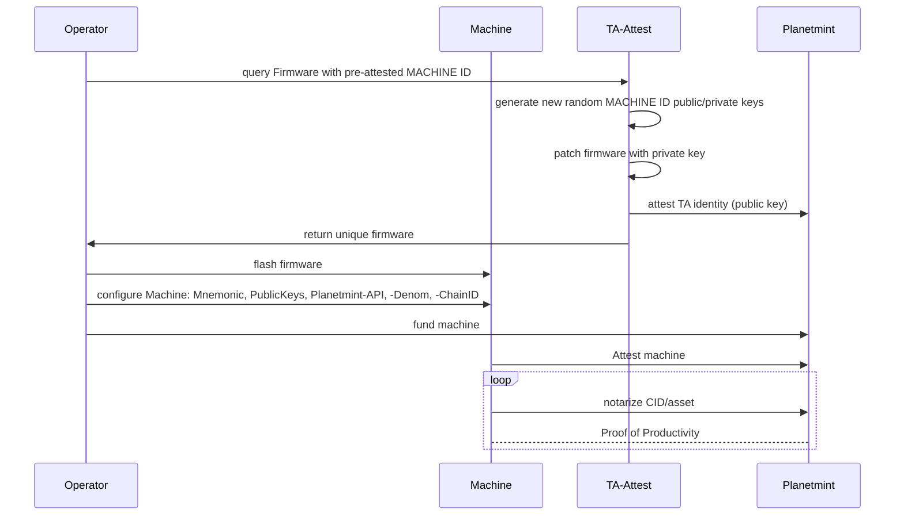

# Machines with unique Firmware  (Testnet\&Mainnet)

```mermaid
sequenceDiagram
    participant Operator
    participant Machine
    participant TA-Attest
    participant Planetmint
    Operator->>TA-Attest: query Firmware with pre-attested MACHINE ID
    TA-Attest->>TA-Attest: generate new random MACHINE ID public/private keys
    TA-Attest->>TA-Attest: patch firmware with private key
    TA-Attest->>Planetmint: attest TA identity (public key)
    TA-Attest->>Operator: return unique firmware
    Operator->>Machine: flash firmware
    Operator->>Machine: configure Machine: Mnemonic, PublicKeys, Planetmint-API, -Denom, -ChainID
    Operator->>Planetmint: fund machine
    Machine->>Planetmint: Attest machine
    loop 
    Machine->>Planetmint: notarize CID/asset
    Machine-->Planetmint: Proof of Productivity
    end
```
