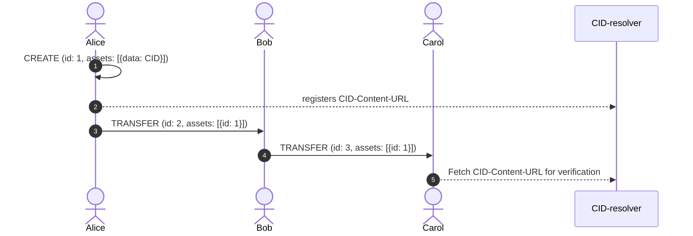

# 💾 Data notarization

The RDDL network utilizes Planetmint to notarize data. Notarization means that RDDLs responsibility is to give an end-user the ability to verify that data has not been tampered with.

**For clarification: The RDDL network does not store any data itself.**&#x20;

Instead, data (encrypted or unencrypted) is hashed via IPLD mechanisms (CIDv0 or CIDv1). Thereafter it is stored publicly available, and the URL, together with the CID, is stored and registered via the CID-resolver service.


CIDs that are referenced on-chain need to be publicly available to be verifiable


Only attested machines are allowed to register data on the CID-resolver service.

## Data Access Control

This concept seems to be simple, but it comes with the potential to craft data access policies and layers by the following mechanism: nesting data references.

#### Publicly available data

Publicly available data is put together with the private to a public\_data\_blob and then hashed

```python
public_data_blob = { public data }
cid_public = cid_from( public_data_blob )
```

The public CID is registered to the [cid-resolver.rddl.io](http://cid-resolver.rddl.io) service:

```json
{ 'key': cid_public, 'value': '<https://public.url>' },
```

#### Private data - encrypted & publicly available

In case of notarized data that should not be accessible to everyone, the data can be encrypted but still be publicly available:

```python
encypted_data = encrypted(private data)
cid_encrypted = cid_from(encypted_data)
```

The CID of the encrypted data is registered to the [cid-resolver.rddl.io](http://cid-resolver.rddl.io) service:

```json
{ 'key': cid_encrypted, 'value': '<https://public.url>' },
```

#### ACL - for assets

An asset is registered with two types of data:

* private data
* public data

The private data is encrypted and hashed

```python
encrypted_data = encrypted(private data)
cid_encrypted = cid_from(encrypted_data)
```

Publicly available data is put together with the private to a public\_data\_blob and then hashed

```python
public_data_blob = {
	'encrypted data cid' = cid_encrypted,
	'public data' = { public data }
}
cid_public = cid_from( public_data_blob )
```

The public CID is registered to the [cid-resolver.rddl.io](http://cid-resolver.rddl.io) service:

```json
{ 'key': cid_public, 'value': '<https://public.url>' },
{ 'key': cid_encrypted, 'value': '<https://public-enc.url>' },
```

## CID verification

A participant can verify the CID of the data stored on-chain in a CREATE transaction. Since we use a UTXO model to ensure ownership integrity, a participant only needs to check the CID of the referenced asset id.

As described above the creation of an asset also entails the registration of a CID-content-URL. The diagram below shows how a network pariticipant would register one and how the receiver of an asset can fetch it for verification.


